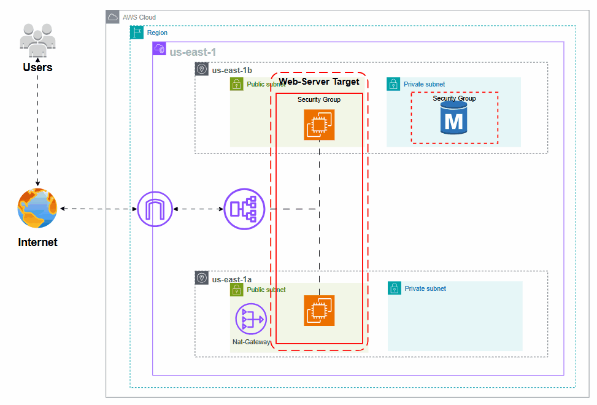

# 📘 Terraform AWS Scalable Infrastructure with Ansible Automation

## 🧠 Architecture Diagram



This project provisions a **complete AWS infrastructure using Terraform modules** to create a highly available, scalable web application backend.  
After provisioning, it uses **Ansible** to configure web servers automatically.

## 📦 Project Structure

```bash
terraform-project/
├── ansible/
│   ├── index.php.j2         # Ansible page template (index.php)
│   ├── playbook.yml         # Ansible playbook to configure EC2 instances
│   └── inventory            # Automatically generated by Terraform after apply
├── modules/
│   └── vpc/                 # VPC and Subnets
│   └── nat_gateway/         # Internet and NAT Gateway
│   └── route_table/         # Public and Private route tables
│   └── security_groups/     # Security groups (ALB, EC2, RDS)
│   └── ssh_key/             # EC2 SSH key pair
│   └── load_balancer/       # ALB + Target Groups + Listeners
│   └── autoscaling/         # Launch Configuration + AutoScaling Group + Inventory Generator
│   └── rds/                 # MySQL RDS Instance
│   └── s3_backend/          # Terraform state backend bucket
├── main.tf
├── providers.tf
├── variables.tf
├── terraform.tfvars
├── outputs.tf
├── backend.tf
└── mykey.pem                # Generated SSH private key
```
## 🚀 Features

- Modular Terraform code.
- Scalable architecture with AutoScaling Group.
- Application Load Balancer for routing traffic.
- Secure RDS MySQL database in private subnets.
- Secure and minimal access security groups.
- Ansible integration to provision web servers post deployment.
- Automatically generated Ansible Inventory file.
- Centralized Terraform state storage in S3 bucket.

## 📌 Terraform Modules Overview

| Module | Description |
|--------|-------------|
| VPC | Creates VPC + public/private subnets |
| NAT Gateway | Allows private subnets outbound internet |
| Route Tables | Configures subnet routing |
| Security Groups | Define rules for ALB, EC2, RDS |
| SSH Key | Generates and deploys EC2 key pair |
| Load Balancer | Deploys Application Load Balancer |
| Autoscaling | Launch config + Auto Scaling Group |
| RDS | MySQL database deployment |
| S3 Backend | Terraform state backend bucket |

## 📦 Ansible Overview

| Component | Description |
|-----------|-------------|
| playbook.yml | Installs Apache, PHP and deploys index.php |
| index.php.j2 | Page template deployed to servers |
| inventory | Generated dynamically after terraform apply |

Once infrastructure is up, Ansible will be used to configure EC2 instances:

```bash
ansible-playbook -i ansible/inventory ansible/playbook.yml
```

## 📝 Documentation

This project can be set up and used through **two different paths** depending on your needs:

1. **Infrastructure Provisioning (Automated via Terraform)**  
   This approach uses modular **Terraform configurations** to automatically provision the entire AWS infrastructure including:
   
   - VPC and Subnets
   - Internet Gateway and NAT Gateway
   - Application Load Balancer (ALB)
   - Auto Scaling Group (EC2 Instances)
   - RDS MySQL Database (Private Subnet)
   - Security Groups
   - S3 Bucket for state backend

   You can follow the step-by-step guide and explanation in the documentation [here](https://shard-knee-e78.notion.site/Scalable-Web-Application-Infrastructure-on-AWS-Terraform-Ansible-1e688e9cf72c80fe84bfc347bc8bc5d7?pvs=4) to set up the infrastructure.

2. **Automated Server Configuration (Ansible)**  
   Once the infrastructure is provisioned, the EC2 instances need to be configured.  
   This is automated using **Ansible Playbooks** that:
   
   - Install Apache and PHP
   - Deploy a simple index.php template
   - Ensure the web service is running

   You can follow the [Ansible automation documentation](https://shard-knee-e78.notion.site/Modules-Of-Scalable-Web-Application-Infrastructure-1e688e9cf72c804e8b54c613f93822c0?pvs=4) to apply Ansible playbooks easily on the provisioned infrastructure.

Both approaches work together to provide a **fully automated and scalable production environment**, from infrastructure creation to server configuration and deployment.

---
